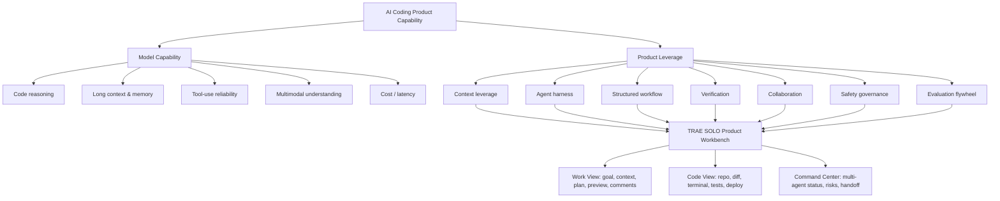

# AI Coding Product Survey

更新日期：2026-06-04

> **基本认知**：AI coding 产品能力 = **模型能力 × 产品能力**。模型能力决定上限，产品能力决定转化率。当前模型还没强到自动补齐真实世界所有上下文、验证、协作和责任边界，所以产品能力不是 UI 外壳，而是把模型能力转成真实交付的放大器。

## 当前结论

AI coding 市场已经从“编辑器里的代码补全”进入 **agent command center / product workbench** 阶段。头部产品不再只比模型写代码能力，而是在比：谁能收集正确上下文、把任务拆成可控计划、在本地/云端执行、持续验证、交付可用产物，并让人类以 reviewer / product owner 的方式管理多个 agent。国内产品池需要同时看 TRAE SOLO、Kimi Code、Zhipu GLM Coding Plan / CodeGeeX：它们分别代表多角色工作台、模型厂商 coding agent、模型套餐 + IDE 插件生态三条路线。

对 TRAE SOLO 来说，机会不是做另一个 Cursor，而是把 AI coding 做成 **多角色工作交付平台**：产品、数据、运营、销售、投研、创业者、工程师都能从需求、资料、数据、草图出发，拿到可以审查、可以运行、可以分享的产物。

**核心仓库**：https://github.com/GameScaler/ai_coding_project_survey

## 每日更新

历史更新口径：过去一周 daily 与 2026-W01～W23 weekly 均按完整核心产品池记录 Kimi Code 与 Zhipu GLM Coding Plan / CodeGeeX；无同级重大更新时只写“无同等级重大公开更新”。

### 2026-06-03

今日是明显的 **agent command center** 信号日。

- **OpenAI Codex**：推出 Sites preview，开始让 Codex 创建、部署、管理网站和内部工具，说明 Codex 的边界已经从代码扩到托管产物。
- **GitHub Copilot**：推出 Copilot app，主打 agent-native desktop experience，把 issue、PR、session、automation 放进一个桌面指挥入口。
- **Windsurf / Devin**：Windsurf 升级为 Devin Desktop，把 IDE、local agent、cloud Devin 和 Agent Command Center 合在一起。
- **Cursor**：Cursor 3.6 的 Auto-review run mode 解决长任务中的 approval friction：让 agent 跑更久，但仍保持安全执行。
- **TRAE SOLO**：TRAE 中国 changelog 显示 SOLO 桌面端在 2026-06-01 支持内置浏览器选中元素并加入对话/评论，这个能力很适合非工程师基于可视化结果反馈。
- **Others**：Kimi Code、Zhipu GLM Coding Plan / CodeGeeX 未观察到同等级重大公开更新；继续分别观察“模型升级 + agent harness”和“模型套餐 + IDE 插件生态”能否升级为端到端 agent workflow。

**产品官短评**：AI coding 的主界面正在从 chat/editor 变成“任务状态 + 产物预览 + 人工审查 + 多 agent 管理”。TRAE SOLO 如果继续强调 Work/Code、移动端、语音、文档/表格/PPT 上下文，应把自己定义成跨角色 product workbench，而不是工程师 IDE 的子模式。

**对 LPME 的影响**：v0.2 需要新增两个任务：一是“长时间自治任务安全控制”，测 approval、sandbox、auto-review、回滚；二是“多 agent command center 协作任务”，测状态管理、冲突处理、人工插入反馈和最终交付。

## 每周复盘

### 本周观察框架

每日更新只记录重要变化；每周复盘负责把碎片变化归纳成路线判断。

- **模型版本迭代**：新模型是否提升 repo 理解、长上下文、工具调用、前端视觉理解、成本/延迟。
- **产品工作流迭代**：是否出现新的 agent harness、auto-review、worktree、cloud agent、mobile handoff。
- **交付物边界扩张**：是否从代码扩到网站、内部工具、PPT、数据分析、报告、自动化。
- **治理和协作**：是否加强权限、审查、回滚、PR/issue/飞书/Slack/Jira 集成。
- **对 TRAE SOLO 的启示**：是否改变 Work/Code、Context Vault、Role Cockpit、Validation Panel 的优先级。

### 2026-W23 初步判断

本周的核心路线是：**长任务自治正在产品化，但产品也在补安全阀**。Codex Sites、Copilot app、Devin Desktop、Cursor Auto-review 都在让 agent 做更长、更完整的任务；同时 approval、review、sandbox、状态管理、回滚也变得更重要。

对 TRAE SOLO 来说，这意味着 **Work 模式不能只是聊天增强**，而要成为任务控制台；**Code 模式不能只是代码执行**，而要把验证、预览、回滚、部署和协作放进统一工作流。

**Others**：Kimi Code、Zhipu GLM Coding Plan / CodeGeeX 本周无同等级重大公开更新；继续作为国内模型厂商 coding agent / 模型套餐 + IDE 插件路线观察。

## 产品版图

| 产品 | 主定位 | 关键形态 | 差异化 | 对 TRAE SOLO 的启示 |
| --- | --- | --- | --- | --- |
| OpenAI Codex | OpenAI 跨端 coding agent | CLI、IDE、桌面 App、云任务、Sites | 多 surface、ChatGPT 账号体系、skills/plugins、产物托管 | Coding agent 正变成通用工作 agent，TRAE 需要把交付物从代码扩到业务产物 |
| Claude Code | Terminal-native agentic coding | CLI、IDE、GitHub、plugins、MCP | 强模型、终端透明度、可组合工具 | 高阶工程师要透明和可控；TRAE 也要保留专家入口 |
| Cursor | AI-native IDE / agent workspace | Editor、Agents Window、cloud agent、automations、canvases、Bugbot、SDK | 围绕 agent 重组 IDE，节奏很快 | 正面竞品；TRAE 要在非工程师、多模态上下文和业务产物上差异化 |
| TRAE SOLO | More Than Coding workspace | Web/Desktop/Mobile、Work/Code、三栏工作区、语音、worktree | 多角色任务、文档/表格/PPT/Python 上下文、反馈和产物在一处 | 应明确“产品交付”而非“代码生成”的北极星 |
| GitHub Copilot | GitHub-native agent platform | VS Code、GitHub issue/PR、CLI、Copilot app、cloud agent | 企业分发、GitHub workflow、治理和审查 | 国内场景可借飞书/GitLab/Gitee/云开发形成工作流入口 |
| Windsurf / Devin Desktop | IDE + 云端自治工程师 | Devin Desktop、Agent Command Center、local/cloud agents | 本地 IDE 与云 agent 融合，Kanban 管理 agent fleet | 多 agent 管理会成为主界面，而不是聊天窗口 |
| OpenClaw | Multi-channel agent gateway | Gateway、Control UI、Workboard、Skill Workshop、channels、plugins/providers | 更像 agent operating system，不是纯 IDE；强调多渠道、多模型、多插件、多设备编排 | TRAE SOLO 要把飞书/移动端/定时任务/外部工具也纳入交付闭环，而不只是在桌面内完成任务 |
| Kimi Code | Kimi 模型体系下的 coding agent | CLI、VS Code/JetBrains via ACP、第三方 agent client、Kimi 会员 | K2.6 for coding、goal/background/subagent、provider 管理 | 模型升级会直接改变产品默认工作流；TRAE 要把模型版本迭代纳入 roadmap |
| Zhipu GLM Coding Plan / CodeGeeX | 智谱 coding 模型套餐 + IDE 助手 | GLM Coding Plan、CodeGeeX VS Code/JetBrains、MCP、开放文档 | 国内模型供给、IDE 插件覆盖、代码生成/补全/解释/review/test | 国内用户可能从模型套餐和插件进入，TRAE 要用端到端交付体验拉开差异 |

### 重大产品功能突破时间线

这部分建议用文字时间线，不单独画图。少于 15 个节点时，真正有价值的是判断哪些节点改变了产品范式，而不是做一张信息密度很低的图。

**入选标准**：只收录改变主入口、自治边界、交付物边界、市场心智，或让模型能力直接改变产品默认 workflow 的节点。普通功能修补、模型小版本、营销更新不进入。

- **2021-06-29｜GitHub Copilot technical preview**：AI coding 从“问答式写代码”变成编辑器内实时共写，autocomplete 成为第一代大众入口。
- **2024-03｜Devin 发布**：用“自主软件工程师 + SWE-bench”重新定义市场叙事，把竞争问题从 completion 推到 end-to-end task。
- **2024-04｜GitHub Copilot Workspace preview**：从 issue / natural language 进入 spec、plan、build、test、run，开始把 Copilot 从助手升级为任务环境。
- **2024-06-20｜Claude 3.5 Sonnet 上线**：模型在 coding、速度和成本上的跃迁，让 Claude 系产品成为 agentic coding 的能力上限参照。
- **2025-02-24｜Claude Code research preview**：Claude Code 把强模型放进 terminal-native 工作流，建立“透明执行、shell / Git / test 可控”的专业开发者心智。
- **2025-04/05｜OpenAI Codex CLI + Codex Cloud**：Codex 从本地终端进入 ChatGPT 云端并行任务，形成 local execution 与 cloud delegation 的双入口。
- **2025-05-19｜GitHub Copilot coding agent public preview**：把 agent 放进 GitHub issue / PR / Actions 闭环，异步开发者开始进入企业工程流。
- **2025-06-04｜Cursor 1.0**：Background Agent、BugBot、Memories、MCP 一起出现，说明 Cursor 不再只是 AI editor，而是在做 agent runtime + review loop。
- **2026-03-31｜TRAE SOLO 0.1.0**：TRAE 把 SOLO 独立为 Web / Desktop 双端、Work / Code 双模式和三栏工作区，明确冲向“More Than Coding”的多角色工作台。
- **2026-04-02｜Cursor 3.0 Agents Window**：主界面从 editor / chat 升级为多 agent 并行窗口，支持 local、worktree、cloud、remote SSH，agent command center 成为正面范式。
- **2026-H1｜Kimi K2.6 + Kimi Code**：国内模型厂商开始把长任务 coding、agent swarm、CLI / IDE / ACP 打成一体，说明模型升级会直接改变产品默认 workflow。
- **2026-H1｜智谱 GLM Coding Plan / CodeGeeX 进入 coding plan 化**：不是单点 IDE 插件创新，而是用模型套餐、支持工具、MCP、团队额度和 CodeGeeX 入口抢占国内开发者工作流。
- **2026-05｜OpenAI Codex /goal**：目标模式把一次 prompt 变成可暂停、恢复、追踪的多小时任务，核心突破是让 agent 有“长期任务对象”而不是只响应回合。
- **2026-05-05/06｜TRAE SOLO Mobile**：手机变成 dispatch console，可以远程触发桌面 / Web 任务、查看进度和语音输入，AI coding 进入跨设备控制阶段。
- **2026-05-29～06-02｜长任务控制台集中爆发**：Cursor 3.6 Auto-review 降低 approval friction；Codex Sites 把代码产物变成托管网站 / 内部工具；GitHub Copilot App 做 agent-native desktop；Devin Desktop 把 local / cloud agent 放进 Kanban；OpenClaw 2026.6 beta 强化 multi-channel gateway、Workboard、Skill Workshop。这一周的共同信号是：AI coding 主战场从“写代码”升级为“管理 agent、验证风险、交付可用产物”。

**压缩判断**：AI coding 的主线是 **completion → repo-aware agent → async cloud engineer → multi-agent command center → product workbench**。TRAE SOLO 不能只追 Cursor 的 IDE 能力；真正的机会在于把 coding agent 变成多角色都能使用的工作交付平台。

详版与资料源：https://github.com/GameScaler/ai_coding_project_survey/blob/main/research/product_breakthrough_timeline.md

## 发展路线

**Phase 1：Assistant in editor**  
代表：Copilot autocomplete、早期 Cursor、Codeium/Windsurf。核心价值是降低写代码成本，但用户仍然要自己拆任务、粘上下文、运行测试、修 bug。

**Phase 2：Repo-aware agent**  
代表：Claude Code、Codex CLI、Cursor Agent、TRAE Agent、Kimi Code、CodeGeeX。产品开始能读 repo、编辑多文件、执行命令、运行测试、解释失败。竞争点从“补全速度”转到“上下文获取 + 工具执行 + 可控修改”。

**Phase 3：Agent workspace**  
代表：Cursor 3 Agents Window、Codex App、GitHub Copilot App、Windsurf/Devin Desktop、OpenClaw Workboard / Control UI、TRAE SOLO、Kimi Code ACP。主界面从 IDE/聊天变成任务工作台：多个 agent 并行，worktree 隔离，云端长任务，PR/CI 回路，用户从写代码者变成任务导演和 reviewer。

**Phase 4：Product workbench**  
目标形态：不仅写代码，还能做数据分析、行业研究、PPT、dashboard、内部工具、落地页、投研模型、运营自动化。这是 TRAE SOLO 最值得押注的阶段。Coding 不是终点，而是把专业工作变成可运行系统、可分享文档、可验证结论的中间手段。

## 技术 Mapping 深入版

AI coding 产品的技术栈可以分成 7 个 leverage layer。

**1. Model capability**  
代码推理、长上下文、工具调用、多模态、成本/延迟、安全可控。模型版本迭代必须单独追踪，因为它会改变产品默认工作流。

**2. Context leverage**  
Repo index、符号图、依赖图、文档/表格/PPT/截图/网页/issue/飞书消息导入、上下文压缩、来源追踪。TRAE SOLO 应把 Context Vault 做成核心模块。

**3. Agent harness**  
Instructions、rules、memory、文件查看器、结构化编辑器、命令执行器、测试执行器、action log、worktree、rollback。SWE-agent 的关键启示是：agent-computer interface 本身就是产品能力。

**4. Structured workflow**  
当前模型还不够稳定时，不能只靠自由探索。Agentless 的启示是：定位、修复、验证这种结构化流程可以显著提升可靠性。TRAE SOLO 应把不同角色任务做成 workflow，而不是只给一个输入框。

**5. Verification**  
测试、lint、typecheck、E2E、浏览器截图、visual diff、数据校验、公式审计、来源引用、verifier model。每个产物都应该带 Validation Panel。

**6. Collaboration**  
PR/issue/Jira/飞书任务、评论、决策日志、变更摘要、订阅推送、多 agent command center。国内场景里飞书文档和群推送应成为 TRAE SOLO 的天然协作入口。

**7. Evaluation flywheel**  
固定回归集 LPME v0.1 + 动态新鲜集 LPME Live + telemetry。SWE-rebench 提醒我们：公开 benchmark 会被污染，产品团队需要固定测试和新鲜任务两套评估。

技术深度材料：

- 技术深度分析：https://github.com/GameScaler/ai_coding_project_survey/blob/main/research/technical_deep_dive.md
- 论文综述与产品启示：https://github.com/GameScaler/ai_coding_project_survey/blob/main/research/paper_notes.md
- 技术思维导图：https://github.com/GameScaler/ai_coding_project_survey/blob/main/research/diagrams/ai_coding_capability_map.mmd
- 核心论文 PDF：https://github.com/GameScaler/ai_coding_project_survey/tree/main/references/papers

### 技术思维导图

## LPME：Last Product Manager Examination

现有 coding benchmark 主要问：模型能否修好一个 issue，或者写出正确代码。产品经理更关心的是：一个 AI coding 产品能否让目标用户在真实上下文中完成可验收的工作。

LPME 的第一性原理：

1. 用户要的是 outcome，不是代码本身。
2. 代码只是把意图变成可执行系统的中间表达。
3. 产品价值来自端到端工作流：理解任务、收集上下文、规划、执行、验证、交付、协作。
4. 模型能力是必要条件，但产品外壳决定真实可用性。
5. 非工程师用户不应该被迫理解 repo、terminal、diff 才能获得价值。

**LPME v0.1 固定测试集**：https://github.com/GameScaler/ai_coding_project_survey/blob/main/benchmark/lpme_v0.1/tasks.yml  
**评分 Rubric**：https://github.com/GameScaler/ai_coding_project_survey/blob/main/benchmark/lpme_v0.1/scoring_rubric.md  
**Benchmark README**：https://github.com/GameScaler/ai_coding_project_survey/blob/main/benchmark/README.md

LPME v0.2 建议新增：

- **Model upgrade sensitivity**：同一产品换模型后，任务成功率、纠错轮次、成本如何变化。
- **Context failure recovery**：故意缺少关键上下文，测试产品是否追问或记录假设。
- **Long-running autonomy control**：测试 auto-review、approval、rollback、checkpoint。
- **Multimodal artifact validation**：测试 screenshot、UI、PPT、图表、网页视觉质量。

## TRAE SOLO 产品建议

TRAE SOLO 应该把自己定义为 **AI-native 工作交付平台**，而不是“AI IDE 的 SOLO 模式”。北极星不是生成了多少行代码，而是不同角色能否用更少上下文成本、更少纠错轮次，拿到一个可审查、可运行、可分享的结果。

**建议北极星指标**

- Time to first usable artifact：从任务输入到第一个可用产物。
- Human correction loops：用户为了达到可用需要纠正几轮。
- Context completeness：系统是否主动发现缺失上下文并提出问题。
- Delivery confidence：用户是否理解 agent 做了什么、风险在哪里、如何回滚。
- Role expansion：非工程师是否可以完成原本需要工程师协助的任务。

**建议产品模块**

- Role Cockpit：产品、数据、运营、销售、投研、创业者、工程师不同首页和任务模板。
- Context Vault：项目资料、历史决策、数据源、品牌规范、代码规则统一管理。
- Work/Code Bridge：Work 模式产出 PRD/分析/方案，Code 模式自动转化为可运行系统。
- Validation Panel：每个产物都有测试、来源、风险、视觉检查、数据校验。
- Review by Artifact：非工程师审查预览、表格、PPT、报告、指标，而不是只审查 diff。
- Feishu-native Loop：文档沉淀、群推送、评论反馈、审批和任务跟踪。

## 自动化更新与订阅

建议每日检查、每周汇总：

- **每日**：只关注重大更新，如新 feature、模型迭代、agent workflow、企业治理、定价变化。无重大更新时只记录“无重大更新”。
- **每周**：把每日碎片变化归纳成路线判断，更新竞争格局和 TRAE SOLO 建议。

MVP 阶段：

- Codex 自动化每天 11:00 运行，生成 `data/daily_updates/YYYY-MM-DD.md`。
- 通过当前 Chrome 登录态写入飞书，或人工确认后发布。

稳定阶段：

- 飞书 Docx API 写入每日更新 block。
- Feishu App Bot 推送摘要给订阅群。
- GitHub 仓库保存 benchmark、每日抓取和历史报告。

当前状态：

- GitHub 已打通：https://github.com/GameScaler/ai_coding_project_survey
- 每日自动化已创建：`ai-coding-daily-product-update`
- Feishu App Bot 已有应用和群聊，会话 ID 已配置到本地订阅表；11 点未推送的原因是自动化运行环境缺少本地 `.env.local` 凭证配置，已修复。
- 产品实测工具链已安装或确认存在：Codex、Claude Code、Cursor、TRAE SOLO、Windsurf。Kimi Code 与 Zhipu GLM Coding Plan / CodeGeeX 先进入公开源监控和后续实测准备。
- 产品实测准备状态：https://github.com/GameScaler/ai_coding_project_survey/blob/main/research/product_testing_setup.md

## 官方资料源

- OpenAI Codex：developers.openai.com/codex/changelog
- Claude Code：code.claude.com/docs/en/changelog
- Cursor：cursor.com/changelog
- TRAE SOLO：docs.trae.ai/solo/changelog、trae.cn/changelog
- GitHub Copilot：github.blog/changelog/label/copilot
- Windsurf / Devin：windsurf.com/changelog、devin.ai/blog/windsurf-is-now-devin-desktop
- OpenClaw：docs.openclaw.ai、github.com/openclaw/openclaw
- Kimi Code：kimi.com/code、github.com/MoonshotAI/kimi-code
- Zhipu / CodeGeeX：docs.bigmodel.cn/cn/coding-plan/overview、codegeex.cn、marketplace.visualstudio.com/items?itemName=aminer.codegeex

资料源配置：https://github.com/GameScaler/ai_coding_project_survey/blob/main/automation/product_sources.json
